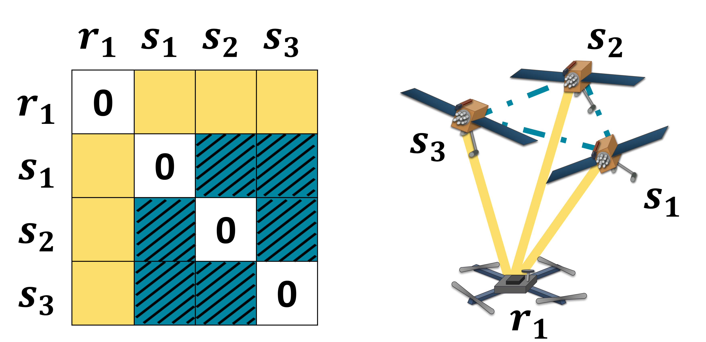

# EDM-FDE

This repository contains code for Euclidean Distance Matrix-based Fault Detection and Exclusion (FDE) based on the paper "Euclidean Distance Matrix-based Rapid Fault Detection and Exclusion" from the ION GNSS+ 2021 conference.



## Install

This repository was developed and tested with Python 3.8+

Install python requirements with `pip install -r requirements.txt`

If wanting to run examples from the google android dataset, you must first download the google android dataset from [here](https://www.kaggle.com/c/google-smartphone-decimeter-challenge/data) and place the train data in the [data/google/train](https://github.com/betaBison/edm-fde/tree/main/data/google/train) directory.

## Run Instructions

EDM-based FDE algorithm is implemented in [src/edm_fde.py](https://github.com/betaBison/edm-fde/blob/main/src/edm_fde.py).

ION GNSS+ presentation/paper figures can be replicated from previously logged data with `python ion_figures.py`

[TU Chemnitz](https://www.tu-chemnitz.de/projekt/smartLoc/gnss_dataset.html.en#Datasets) results can be replicated (up to the random initialization) with `python main_chemnitz.py`

Results from the google android dataset can be replciated by downloading the google data (see above), adding all traces and phone types to the trace list at the end of the [main_google.py](https://github.com/betaBison/edm-fde/blob/main/main_google.py) file, and running `python main_google.py` 

## Citation
If referencing EDM-based FDE in your work, please cite the following paper:
```
@inproceedings{Knowles2021,
author = {Knowles, Derek and Gao, Grace},
title = {{Euclidean Distance Matrix-based Rapid Fault Detection and Exclusion}},
booktitle = {Proceedings of the 34th International Technical Meeting of the Satellite Divison of the Institute of Navigation, ION GNSS + 2021},
publisher = {Institute of Navigation},
year = {2021}
}
```
